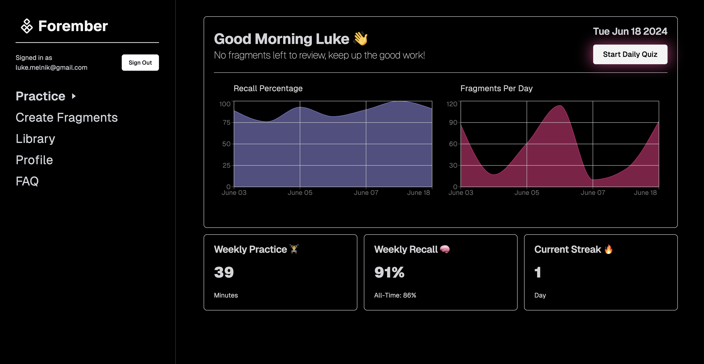

# Forember - An AI-powered Spaced Repetition App

[](https://forember-9vyt.vercel.app/)

## [Try It Live Here ->](https://forember-9vyt.vercel.app/)

## What I Learned

- Nextjs
  - server components
  - server actions
  - api routes
  - app structure in the app router
  - using url & search params to store state
  - caching
- OpenAI API
  - optimizing the prompt
  - ensuring data is received in the right shape and displaying it to the user
- The intricacy of JavaScript dates
- React Context API & useReducer for actions & state management in deeply nested components
- React Hook Form
- Zod for validation both on the client and on the server
- Shadcn Components
- Tailwind
- PostgreSQL via Supabase
  - table structure
  - row level security
  - migrations
  - authentication
  - views & complex queries
  - full-text search for finding fragments in the library

## Installation

1. Clone the repo:

```
git clone git@github.com:lukemelnik/forember.git
```

2. Install dependencies:

```
npm install
```

3. [Grab an OpenAI API key](https://platform.openai.com/).

- Add your OPENAI_API_KEY, OPENAI_ORGANIZATION_ID & OPENAI_PROJECT_ID to a .env.local file (see .env.example for reference)

```
OPENAI_API_KEY=your_openai_api_key_here
OPENAI_ORGANIZATION_ID=your_openai_organization_id_here
OPENAI_PROJECT_ID=your_openai_project_id_here
```

4. [Sign up for Supabase](https://supabase.com)

- Create a database
- Add NEXT_PUBLIC_SUPABASE_URL and NEXT_PUBLIC_SUPABASE_ANON_KEY to the .env.local file

```
NEXT_PUBLIC_SUPABASE_URL=your_supabase_url_here
NEXT_PUBLIC_SUPABASE_ANON_KEY=your_supabase_anon_key_here
```

5. Apply the most recent migration to your database

6. Start the development server:

```
npm run dev
```

## Tech used

React, Next.js, Node.js, PostgreSQL, Supabase, TailwindCSS, Shadcn Components, Vercel, OpenAI
